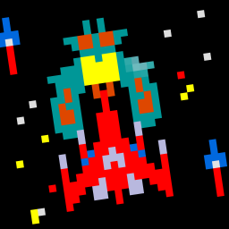

 

  

  <h3 align="center">Computing 1/2 SAC #2</h3>

  

    By Alexander Cleary
     
     
    Dependencies: 
     
    - pygame
     
     
    <a href="https://github.com/ClearyCoding/Computing-SAC1/issues">Report Bug</a>
    .
    <a href="https://github.com/ClearyCoding/Computing-SAC1/issues">Request Feature</a>
  

